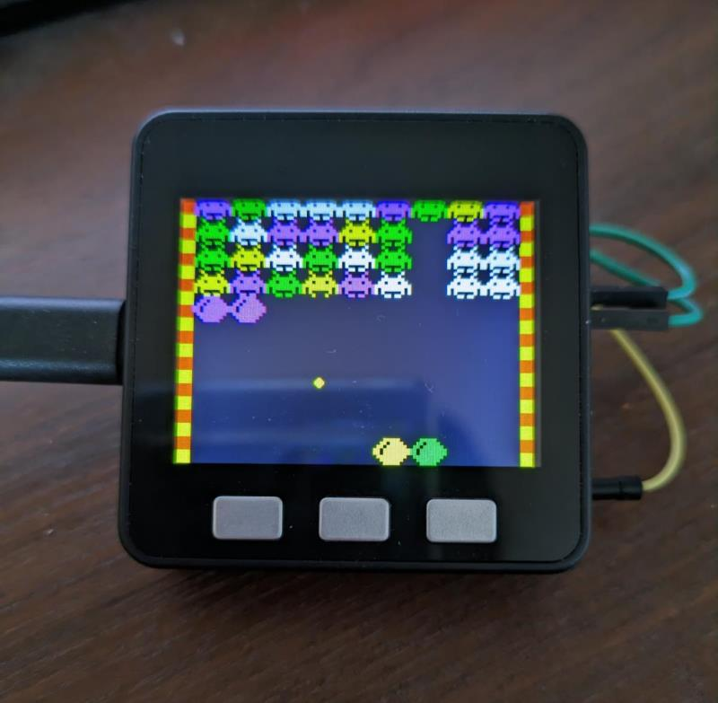
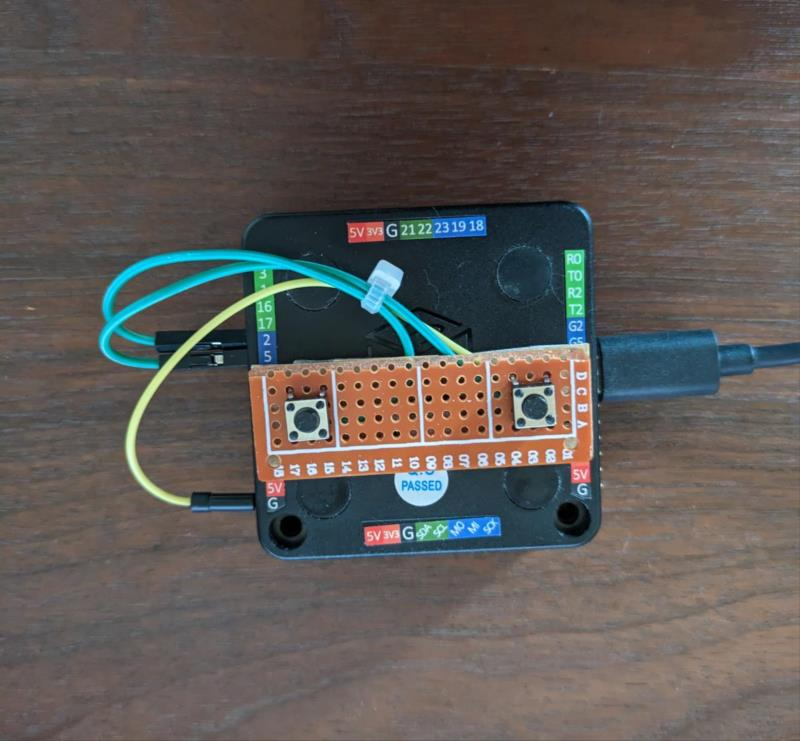

# puyo_vaders

## 概要 (Overview)

M5Stackを用いたゲームです。 
ぷよぷよとインベーダーゲームを合体させました。 
プレイヤーはぷよぷよを投げてインベーダーを倒します。 
4つ以上同じ色を揃えると消えます。

## 動画 (Movie)

https://www.youtube.com/watch?v=0uXJU6Ajo8I

## 画面イメージ (ScreenShot)
 
 

## 動作要件 (Requirements)

M5Stack Basic / C++ PlatformIO

## 回路図 (Circuit diagram)

|M5Stack|SWITCH|
| ------------- | ------------- |
|G2|CW_ROTATE|
|G5|CCW_ROTATE|
|GND|CW_ROTATE|
|GND|CCW_ROTATE|

G2,G5 は内部プルアップ設定
## ライセンス (License)

This software is released under the MIT License, see LICENSE.
